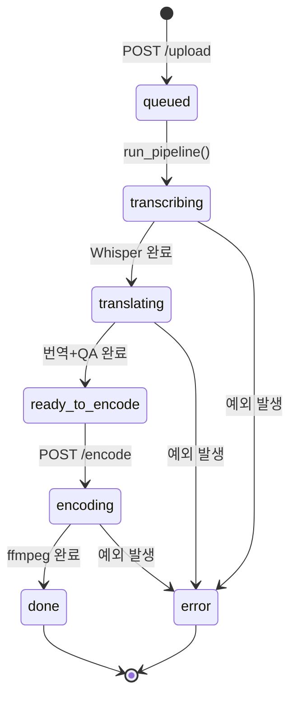
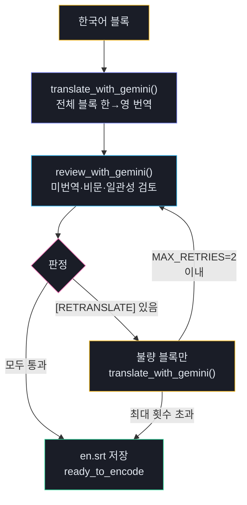
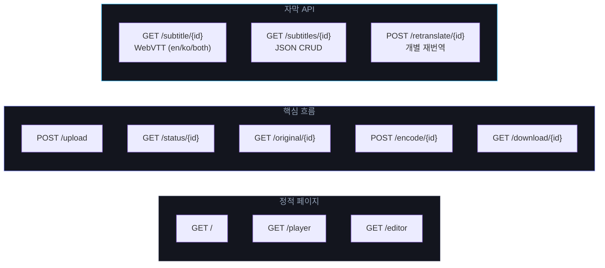
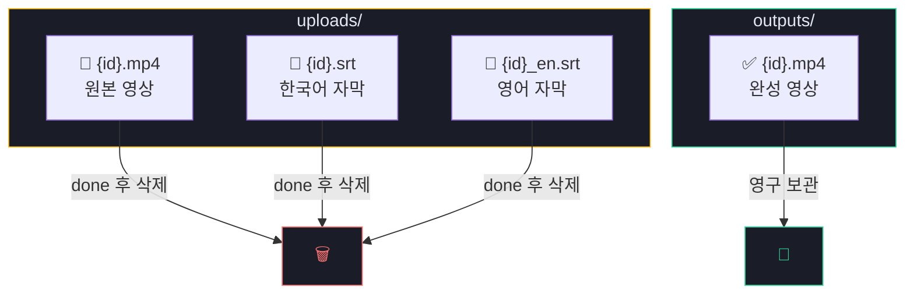
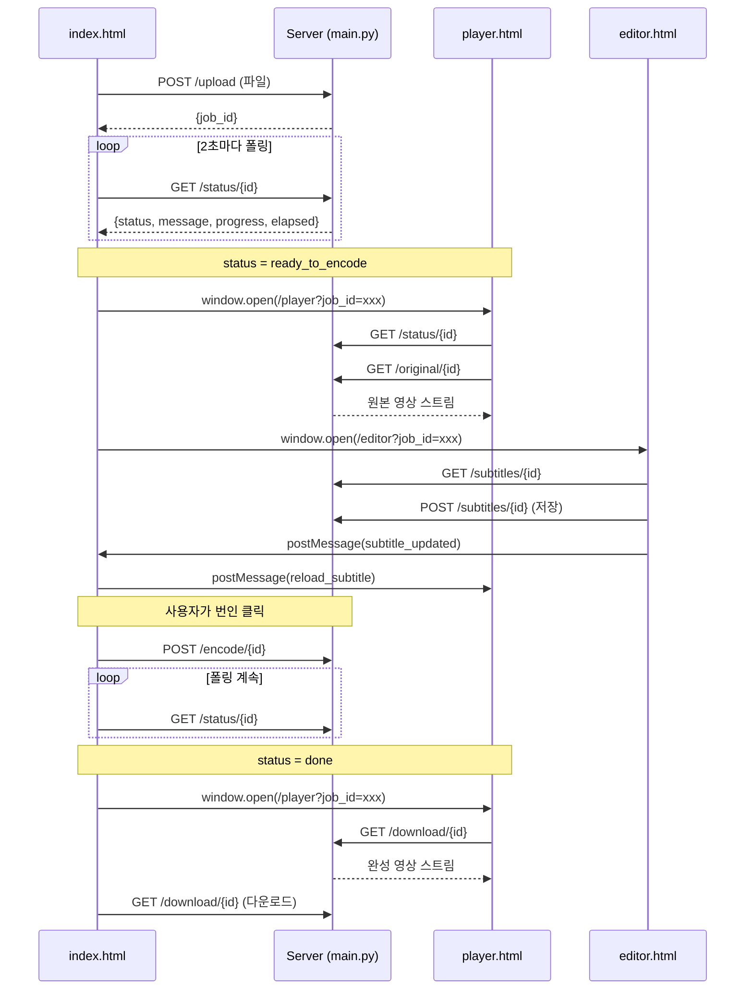
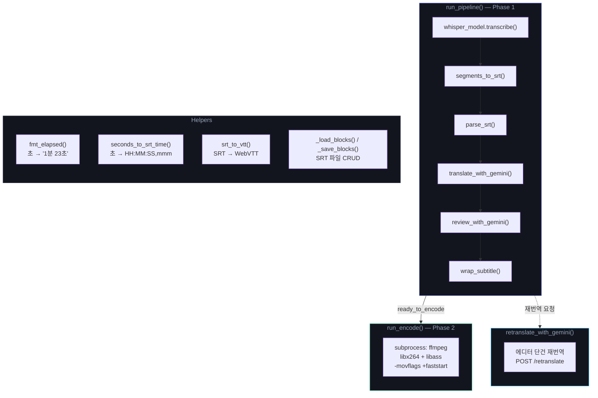

# main.py Architecture

## 1. Processing Pipeline

```mermaid
flowchart LR
    Upload["📁 Upload\nPOST /upload"]
    Whisper["🎤 Whisper\n음성인식"]
    Gemini["🌍 Gemini\n번역 + QA"]
    Wait["✏️ 편집 대기\n사용자 확인"]
    FFmpeg["🎬 ffmpeg\n자막 번인"]
    Done["✅ 완료\n다운로드"]

    Upload -->|"executor.submit\n(run_pipeline)"| Whisper
    Whisper -->|"{job_id}.srt\n한국어"| Gemini
    Gemini -->|"{job_id}_en.srt\n영어"| Wait
    Wait -->|"POST /encode\n(run_encode)"| FFmpeg
    FFmpeg -->|"outputs/{job_id}.mp4"| Done

    style Upload fill:#1a1d27,stroke:#38bdf8,color:#e2e8f0
    style Whisper fill:#1a1d27,stroke:#818cf8,color:#e2e8f0
    style Gemini fill:#1a1d27,stroke:#818cf8,color:#e2e8f0
    style Wait fill:#1a1d27,stroke:#fbbf24,color:#e2e8f0
    style FFmpeg fill:#1a1d27,stroke:#818cf8,color:#e2e8f0
    style Done fill:#1a1d27,stroke:#34d399,color:#e2e8f0
```

## 2. Job State Machine

## 3. Gemini QA Review Loop

## 4. API Endpoints

## 5. File Lifecycle

## 6. Frontend 통신 구조

## 7. Internal Functions Map

